# E-Commerce Sales & Profit Analyst

[](https://www.python.org/)
[](https://www.microsoft.com/en-us/sql-server)
[](https://powerbi.microsoft.com/)
[](LICENSE)

An end-to-end exploratory and dimensional analysis of e-commerce retail transactions using **Python, Microsoft SQL Server (T-SQL), and Microsoft Power BI**. This project evaluates multi-dimensional sales performance, profit margin dynamics, discount sensitivity, and customer purchase patterns to deliver data-driven business insights.

> **Attribution & Context:** This repository is an adapted and enhanced version of the open-source reference project by [Dheeraj (Dheeraj-Official/E-Commerce-Sales-Profit-Analyst)](https://github.com/Dheeraj-Official/E-Commerce-Sales-Profit-Analyst), with improved documentation, dependency pinning, verified reproducible notebook executions, and clean environment setup.

---

## 1. Project Summary

- **Domain:** Retail & E-Commerce Omnichannel (Technology, Furniture, Office Supplies)
- **Dataset:** Sample Superstore Transactional Dataset (2014 – 2017)
- **Total Transactions:** 9,994 order lines

### Key Verified Metrics
| Metric | Value |
| :--- | :--- |
| **Total Net Sales** | **$2,297,200.86** |
| **Total Net Profit** | **$286,397.02** |
| **Overall Profit Margin** | **12.47%** |
| **Total Unique Orders** | **5,009** |
| **Unique Customers** | **793** |
| **Unique Products** | **1,862** |
| **Total Units Sold** | **37,873** |
| **Average Order Value (AOV)** | **$458.61** |
| **Average Discount** | **15.62%** |

---

## 2. Project Structure

```
E-Commerce-Sales-Profit-Analyst/
│
├── data/
│   ├── dictionary/
│   │   └── data_dictionary.csv          # Column definitions and metadata
│   ├── raw/
│   │   └── ecommerce_raw.csv            # Original raw transactional dataset (9,994 rows)
│   └── processed/
│       └── ecommerce_clean.csv          # Cleaned dataset with derived analytical features
│
├── notebooks/
│   ├── ecommerce_analysis.ipynb        # Main analysis & interactive visualization notebook
│   └── import_data_mssql.ipynb          # SQL Server database ingestion via SQLAlchemy
│
├── power BI/
│   ├── PowerBI.pbix                     # Original Power BI dashboard model
│   └── Icon Images/                     # Custom KPI visual SVG/PNG icon assets
│
├── screenshots/
│   ├── Notebook_Screenshots/            # Static exports of analytical charts
│   └── PowerBI_Screenshots/             # Dashboard page captures
│
├── sql/
│   ├── 01_Database_and_Table_setup/     # Schema, table creation, and analytical views
│   ├── 02_Data_cleaning_sql/            # Data quality checks, duplicates, and outliers
│   ├── 03_KPI_Analysis/                 # Core KPIs and dimensional breakdowns
│   ├── 04_Customer_Analysis/            # Customer ranking, RFM, cohorts, and frequency
│   ├── 05_Product_Analysis/             # SKU performance, categories, and profitability matrix
│   ├── 06_Time_Series_Analysis/         # Monthly trends, MoM/YoY growth, and seasonality
│   ├── 07_Advanced_Business_Question/   # 30 targeted business questions with SQL queries
│   ├── 08_ETL_Star_Schema/              # Dimensional ETL scripts populating Star Schema
│   └── ER_Diagram.png                   # Dimensional Entity Relationship Diagram
│
├── requirements.txt                     # Python dependencies
├── .gitignore                           # Git ignore rules
├── LICENSE                              # MIT License with upstream attribution
└── README.md                            # Project documentation
```

---

## 3. Data Description

**Dataset Source:** Sample Superstore Dataset (Public Domain)

- **Primary Attributes:** `Order ID`, `Order Date`, `Ship Date`, `Ship Mode`, `Customer ID`, `Customer Name`, `Segment`, `Country`, `City`, `State`, `Postal Code`, `Region`, `Product ID`, `Category`, `Sub-Category`, `Product Name`, `Sales`, `Quantity`, `Discount`, `Profit`.
- **Derived Features:** `Year`, `Quarter`, `Month`, `Month_Name`, `Year_Month`, `Week`, `Day_of_Week`, `Order_to_Ship_Days`, `Profit_Margin`, `Sales_per_Quantity`, `Discount_Band`.

---

## 4. Key Analytical Findings

### A. Sales Performance
- **Top Category:** Technology ($836,154 sales | 36.4% of total revenue)
- **Top Region:** West ($725,458 sales | 31.6% of total revenue)
- **Top State:** California ($457,688 sales | 19.9% of total revenue)

### B. Profitability & Margin Dynamics
- **Most Profitable Category:** Technology ($145,455 profit | 17.40% margin)
- **Loss-Making Transactions:** 18.72% of all order lines (1,871 transactions) generated negative profit, eroding **-$156,131.29** in margin.
- **Overall Blended Margin:** 12.47%

### C. Product Insights
- **Top Profitable Product:** *Canon imageCLASS 2200 Advanced Copier* ($61,599.82 sales | $25,199.93 profit | 40.9% margin)
- **Heaviest Loss SKU:** *Cubify CubeX 3D Printer Double Head Print* (-$8,879.97 net loss on 70% discount)
- **Underperforming Sub-Categories:** Tables (-$17,725 loss) and Bookcases (-$3,473 loss) act as structural margin drags.

### D. Customer Insights
- **Average Revenue per Customer:** $2,896.85
- **Average Order Value (AOV):** $458.61
- **Customer Repeat Rate:** High multi-purchase loyalty across B2B segments (Consumer, Corporate, Home Office).

### E. Discount Impact & Margin Destruction
- **Average Discount:** 15.62%
- **0% Discount Orders:** 47.98% of volume $\rightarrow$ **34.02% profit margin** ($320,988 profit)
- **1–20% Discount Orders:** 38.05% of volume $\rightarrow$ **17.35% profit margin** ($100,785 profit)
- **30%+ Discount Orders:** 11.67% of volume $\rightarrow$ **-91.47% profit margin** (-$125,007 loss)
- **Conclusion:** Strong inverse correlation ($r = -0.219$) between promotional discounts and net profitability; discounts $>20\%$ consistently trigger net losses.

---

## 5. Database Schema & Dimensional Model

The project includes an analytical **Star Schema** with dimension tables and a centralized fact table:

- **Fact Table:** `fact_sales`
- **Dimension Tables:** `dim_customer`, `dim_product`, `dim_date`, `dim_location`
- **Denormalized Analytical Table:** `ecommerce_sales`

### Entity Relationship Diagram (ERD)

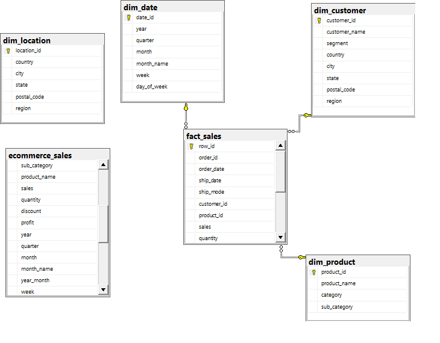

---

## 6. Power BI Dashboard

The Power BI report (`power BI/PowerBI.pbix`) provides interactive visualizations across 5 analytical views:

### Dashboard Overview
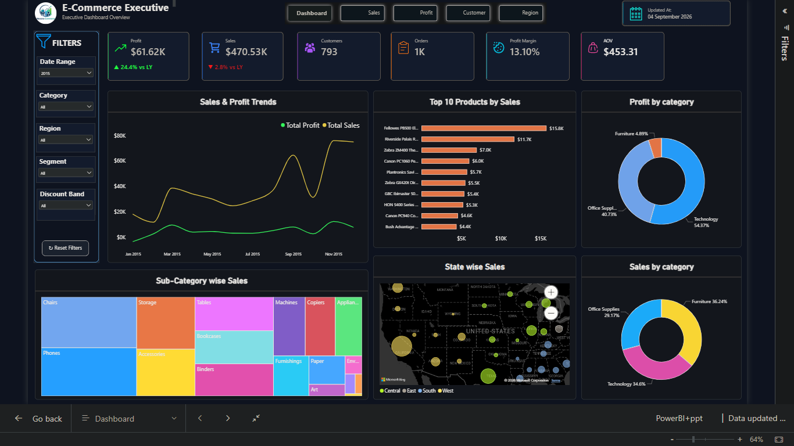

### Profit Analysis
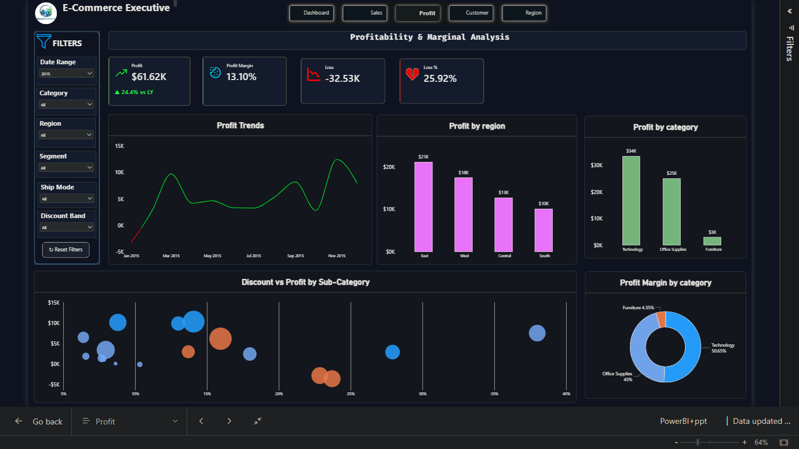

### Sales Breakdown
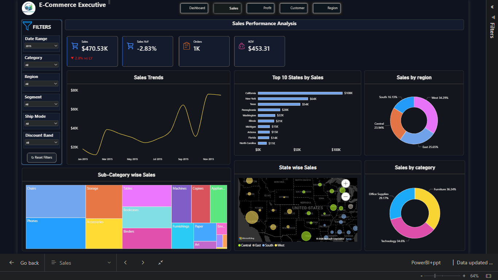

### Customer Analysis
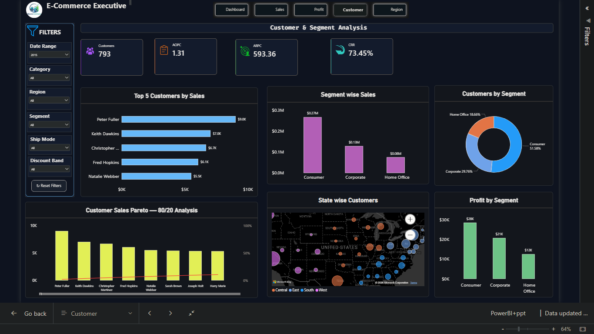

### Regional Performance
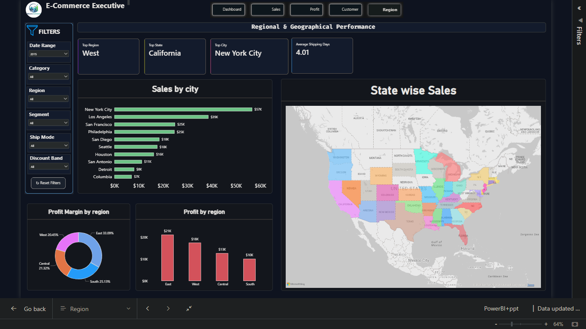

---

## 7. Python Exploratory Visualizations

Selected visualizations generated in `notebooks/ecommerce_analysis.ipynb`:

| Monthly Sales Trends | Monthly Profit Trends |
| :---: | :---: |
| 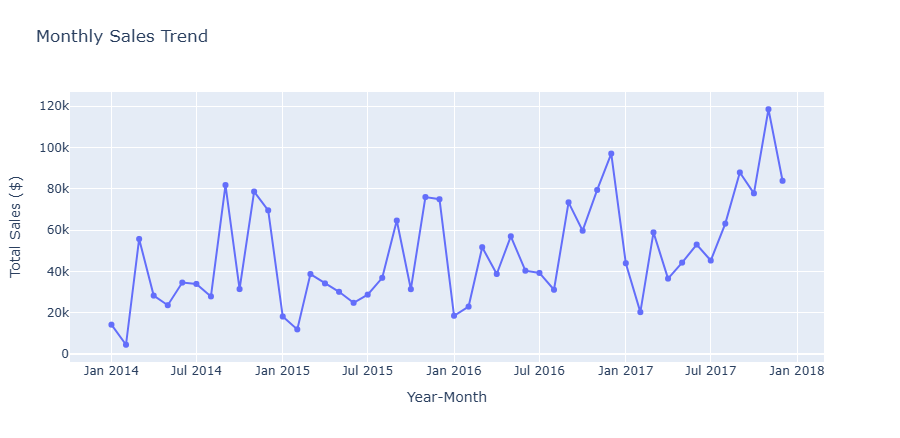 | 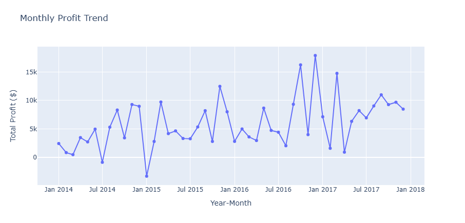 |

| Sales by Category | Profit by Category |
| :---: | :---: |
| 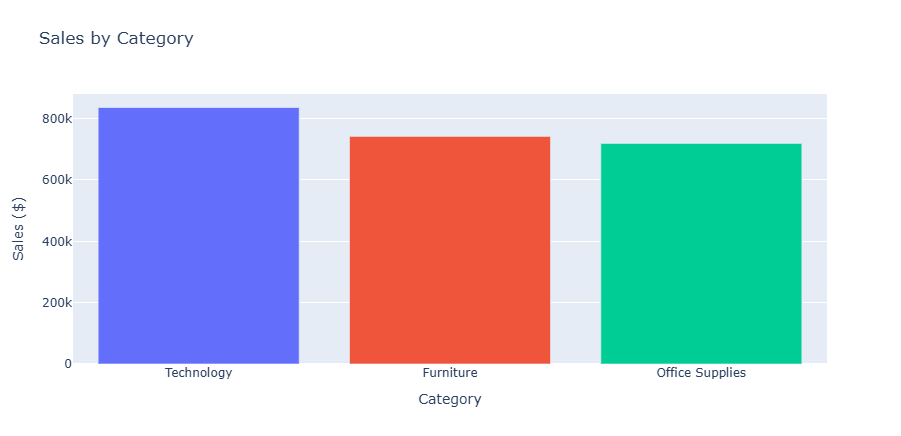 | 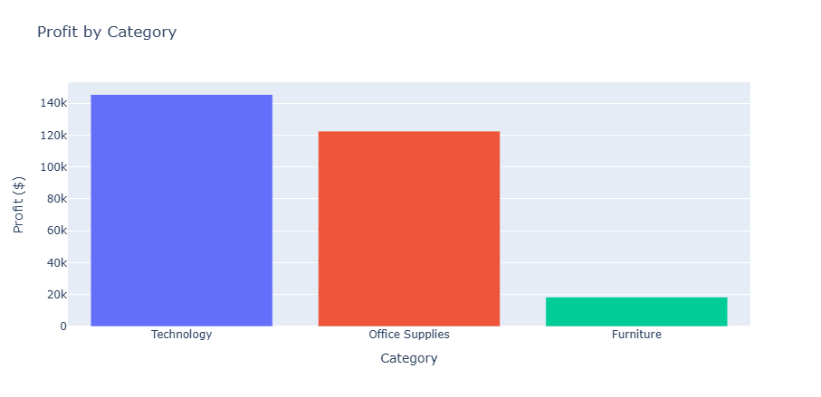 |

| Sales by Region | Top 10 Products by Sales |
| :---: | :---: |
| 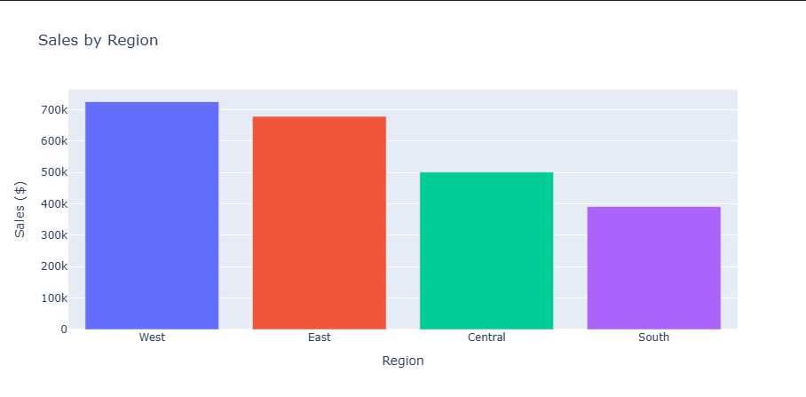 | 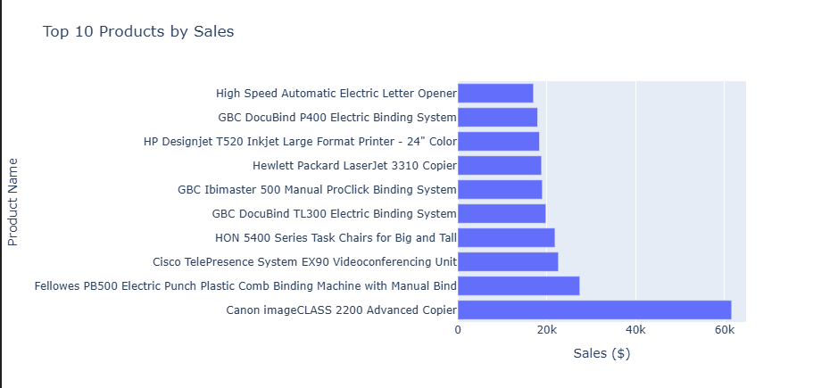 |

---

## 8. Installation & Usage

### A. Environment Setup
```bash
# Clone the repository
git clone https://github.com/mhmd-ebrahim-1/E-Commerce-Sales-Profit-Analyst.git
cd E-Commerce-Sales-Profit-Analyst

# Create and activate virtual environment
python -m venv venv
.\venv\Scripts\activate   # On Windows
# source venv/bin/activate # On macOS/Linux

# Install dependencies
pip install -r requirements.txt
```

### B. Run Jupyter Analysis Notebook
```bash
jupyter notebook notebooks/ecommerce_analysis.ipynb
```

### C. Execute SQL Queries
Connect to your Microsoft SQL Server instance (or SSMS / Azure Data Studio) and run the scripts in `sql/`:
```sql
USE ecommerce_analytics;
SELECT 
    Category,
    ROUND(SUM(Sales), 2) AS Total_Sales,
    ROUND(SUM(Profit), 2) AS Total_Profit,
    ROUND(SUM(Profit) / SUM(Sales) * 100, 2) AS Profit_Margin_Pct
FROM ecommerce_sales
GROUP BY Category
ORDER BY Total_Sales DESC;
```

### D. Open Power BI Dashboard
Open `power BI/PowerBI.pbix` directly in **Power BI Desktop** to interact with the report visuals, filters, and slicers.

---

## 9. Technologies Used

- **Python:** pandas, numpy, scipy, matplotlib, seaborn, plotly, jupyter
- **Database:** Microsoft SQL Server (T-SQL), SQLAlchemy, pyodbc
- **BI & Visualization:** Microsoft Power BI Desktop
- **Version Control:** Git, GitHub

---

## 10. Acknowledgments & Attribution

- **Original Author & Repository:** [Dheeraj-Official/E-Commerce-Sales-Profit-Analyst](https://github.com/Dheeraj-Official/E-Commerce-Sales-Profit-Analyst)
- **Dataset:** Public Domain Sample Superstore Dataset
